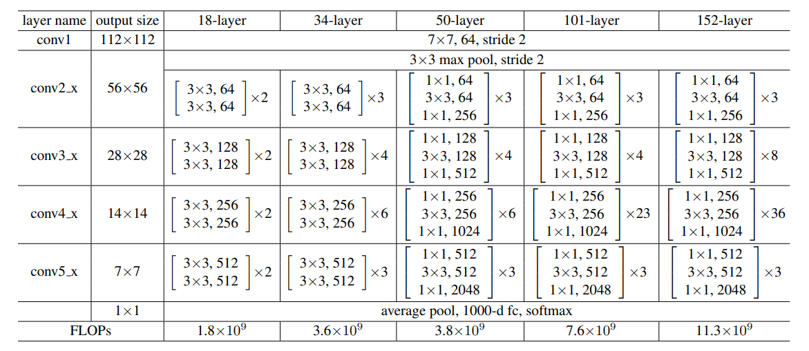

# Diabetic Retinopathy Detection with ResNet

## Introduction

糖尿病所引發視網膜病變是眾多患者失明的原因。從視網膜圖像可以幫助醫生判斷患者的病況。本次實驗的主題便是用深度學習的方式訓練模型來學習視網膜圖像的辨識。模型架構為 ResNet，ResNet 是一種使用了 residual 結構的神經網路，特點是它能減少梯度消失的現象。ResNet 但架構又能分為數種，我們本次使用的是 ResNet 18 和 ResNet 50，並且各測試模型是否 pretrained 的影響。

## Dataset

Diabetic Retinopathy Detection
- test_img.csv: 描述哪些圖片檔是 testing data
- train_img.csv: testing data 對應到的 label
- test_img.csv: 描述哪些圖片檔是 training data
- train_img.csv: training data 對應到的 label 

## ResNet Models

ResNet 18 和 ResNet 50 的構造如下圖中 18-layer 和 50-layer 的欄位。

資料來源：[Deep Residual Learning for Image Recognition](https://arxiv.org/abs/1512.03385)

中括號裡為 block 的構造。ResNet 18 使用的是兩層的構造（如下圖左邊），ResNet50 由於模型複雜度較高，採用的是 Bottleneck Block （如下圖右邊）。

資料來源：[Deep Residual Learning for Image Recognition](https://arxiv.org/abs/1512.03385)

## Experimental Results

### Confusion Matrix

下面這張圖是用 ResNet 18 Pretrained 再練過所測的。橫軸是預測結果，縱軸是正確答案。可以看到這個 confusion matrix 的特點是數量集中在上方，表示資料集大部分的資料都屬於 class 0，其它分類的數量較小。

有趣的是 Non-Pretrained 的兩種模型效果都不太好。

### Comparison Figures

橘色是有 pretrained，藍色是  non-pretrained。實線是 training，虛線是 testing。Non-pretrained 都差不多，pretrained 的 ResNet 50 比較好。

